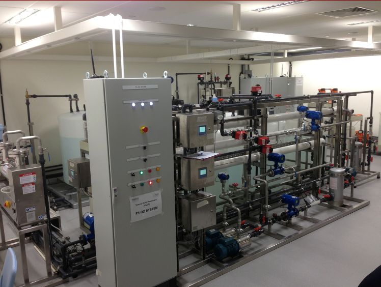

Anomaly-Detection-LSTM-GRU
==============================

Some experiments with LSTMs and GRUs for anomaly detection use cases on publicly available dataset(s).
We demonstrate the use of a Seq2Seq autoencoder for detecting anomalies in multivariate time series.
The data we used was created in a scaled down water treatment system for research purposes.
That thing looks like this:

The corresponding paper can be found [here](https://link.springer.com/chapter/10.1007%2F978-3-319-71368-7_8).
Some helpful dataset description can be found [here](https://itrust.sutd.edu.sg/itrust-labs_datasets/dataset_info/)

Run the experiment
---
To reproduce the experiment follow these steps:
- clone this repo
- download the whole 2015 folder from [this link](https://drive.google.com/drive/folders/1ABZKdclka3e2NXBSxS9z2YF59p7g2Y5I)
- copy all the zip archives the raw data directory
- navigate to the project root and run:
```shell
unzip './data/raw/*.zip' -d ./data/interim 
mv ./data/interim/SWaT.A1\ _\ A2_Dec\ 2015/*.pdf ./references
mv ./data/interim/SWaT.A1 _ A2_Dec 2015/* ./data/interim/
rm -r ./data/interim/SWaT.A1 _ A2_Dec 2015
```
- set up a virtual environment (conda in my case) and install the dependencies. From the root of this project, run:
```shell
conda create -n ano 
conda activate ano
pip install -e .
```
- Optional: if you want to reproduce exactly the environment I was working in, run the following with the 'ano' environment activated (all my development tools are also listed):
```shell
pip install -r requirements.txt
```
- Now run the following command to transform the excel files into a h5 data store 
```shell
python ./anodeclstmgru/data/create_h5_file.py
```
- From here you should be able to run the data exploration notebooks ('notebooks/01-Exploration.ipynb' and 'notebooks/02-Time_series_exploration.ipynb')
- Now run the following to run the data preparation script:
```shell
python anodeclstmgru/data/data_preparation.py
```
- To kick off a model training processes, you  can modify and use the scripts stored in the 'utils' directory. E.g.:
```shell
./utils/run_training_gpu.sh
```
- If you like to see the training process in a tensorboard, run:
```shell
tensorbaord --logdir lightning_logs
```


Project Organization
------------

```
.
├── README.md
├── anodeclstmgru
│   ├── __init__.py
│   ├── constants.py
│   ├── data
│   │   ├── __init__.py
│   │   ├── create_h5_file.py
│   │   ├── data_module.py
│   │   ├── data_preparation.py
│   │   └── dataset.py
│   ├── features
│   │   └── __init__.py
│   ├── models
│   │   ├── __init__.py
│   │   ├── lit_module.py
│   │   └── train_model.py
│   └── visualization
│       └── __init__.py
├── data
│   ├── external
│   ├── interim
│   │   ├── List_of_attacks_Final.xlsx
│   │   ├── Network
│   │   │   ├── 2015-12-22_034215_69.log.part01_sorted.csv
│   │   │   ├── 2015-12-22_034215_69.log.part02_sorted.csv
│   │   │   ├── 2015-12-22_034215_69.log.part03_sorted.csv
│   │   │   └── ... 
│   │   ├── Physical
│   │   │   ├── SWaT_Dataset_Attack_v0.xlsx
│   │   │   ├── SWaT_Dataset_Normal_v0.xlsx
│   │   │   └── SWaT_Dataset_Normal_v1.xlsx
│   │   └── data_store.h5
│   ├── processed
│   │   └── data_store.h5
│   └── raw
├── lightning_logs
├── models
├── notebooks
│   ├── 01-Exploration.ipynb
│   ├── 02-Time_series_exploration.ipynb
│   └── 03-Model_output_exploration.ipynb
├── references
│   ├── A Dataset to Support Research in the Design of Secure Water Treatment Systems.pdf
│   ├── List_of_attacks_Final.pdf
│   └── plant_pic.png
├── reports
│   └── figures
├── requirements.txt
├── setup.py
└── utils
    ├── run_training_gpu.sh
    └── run_training_no_gpu.sh
```
